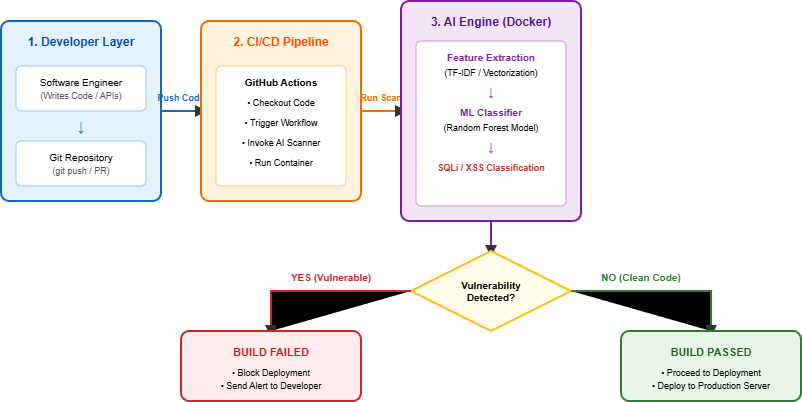
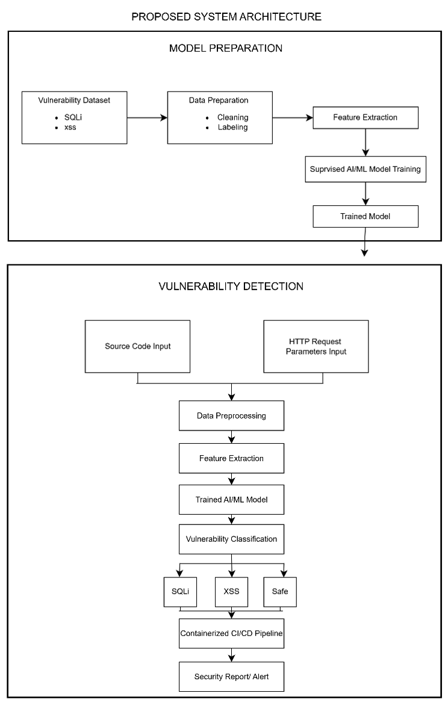
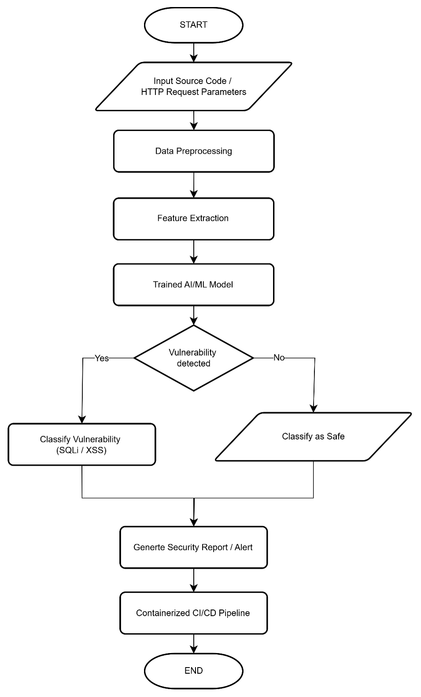

# ai-devsecops-pipeline
AI AUTOMATED WEB VULNERABILITY DETECTION INTEGRATED WITH DEVSECOPS
# CHAPTER 1: INTRODUCTION

## 1.1 Introduction

In the evolving landscape of modern software engineering, web applications have become an essential platform for business operations, handling critical transactions and storing sensitive user information. However, their widespread accessibility also makes them attractive targets for cyberattackers. Among the common threats are injection flaws and client-side scripting attacks, which are highlighted in the Open Web Application Security Project (OWASP) Top 10.

This chapter introduces the main issues addressed in this research and provides the background needed to understand the study. It discusses the problem statement, research aims and objectives, as well as the rationale and significance of the research. By establishing the context of the study, this chapter explains why the issue is important and worth investigating. It also outlines the direction of the research and the objectives that the study aims to achieve.

---

## 1.2 Background of the Study

To support faster software release cycles, many software engineering teams have adopted DevSecOps practices that integrate security controls directly into Continuous Integration and Continuous Deployment (CI/CD) pipelines. Traditional security testing methods, particularly Static Application Security Testing (SAST) and Dynamic Application Security Testing (DAST), are often incorporated into these pipelines. However, these tools can generate a high number of false positives and may require considerable execution time, which can slow down build and deployment processes.

Artificial Intelligence (AI) and Machine Learning (ML) provide a potential way to address these limitations by going beyond conventional rule-based scanning. Instead of relying solely on predefined security rules, AI-driven techniques can learn from code structures and web traffic patterns to identify and classify vulnerabilities based on their context. When lightweight AI inference models are integrated into DevSecOps pipelines, security checks can be performed more efficiently while reducing unnecessary alerts. This can help development teams maintain continuous security enforcement without significantly affecting the speed of software delivery.

### System Conceptual Architecture

*Figure 1.1: Conceptual Architecture of Proposed AI-Assisted DevSecOps Framework*

---

## 1.3 Problem Statement

Despite the growing use of automated security tools in DevSecOps pipelines, software development teams still face several challenges when trying to maintain effective and efficient security testing:

* **a. High False-Positive Rates:** Existing SAST and DAST tools can generate a large number of false-positive results. As a result, developers and security engineers often need to manually review and validate flagged issues, which takes additional time and effort that could otherwise be spent on development activities.
* **b. Deployment Bottlenecks:** Another challenge is the time and computational resources required for comprehensive dynamic security testing. When these scans take too long to complete, they can slow down pipeline execution and make it more difficult for development teams to maintain rapid release cycles.
* **c. Limited Context-Aware Detection:** Traditional rule-based detection methods also have limitations when dealing with the complexity of modern web applications. Since they mainly rely on predefined patterns and rules, they may not fully understand the context of the code being analyzed. This can result in vulnerabilities being overlooked, including previously unknown or zero-day vulnerabilities, while legitimate code may sometimes be incorrectly classified as a security threat.

---

## 1.4 Research Questions

1. **RQ1:** What are the current limitations and capabilities of existing software security testing tools and AI-based vulnerability detection techniques for web applications?
2. **RQ2:** How can an AI-assisted web vulnerability detection prototype be designed and seamlessly integrated into an automated DevSecOps pipeline?
3. **RQ3:** How effective is the proposed AI-assisted approach in terms of detection accuracy, false-positive rate reduction, and overall execution speed?

---

## 1.5 Research Objectives

1. **RO1:** To analyze existing software security testing and AI-based vulnerability detection techniques for web applications.
2. **RO2:** To design and develop a prototype for automated detection of selected web application vulnerabilities using an AI-assisted approach.
3. **RO3:** To evaluate the proposed approach based on detection performance, false-positive rate, and detection time.

---

## 1.6 Scope of Study

This research focuses on the automated detection of key web application vulnerabilities (specifically SQL Injection and Cross-Site Scripting) within source code and HTTP request parameters. The AI detection model will utilize supervised machine learning techniques trained on standard benchmark vulnerability datasets. The prototype will be integrated into a containerized CI/CD environment (such as GitHub Actions or GitLab CI) to simulate a real-world DevSecOps execution workflow.

---

## 1.7 Significance of Study

This study contributes to the field of software security and DevSecOps automation by demonstrating how machine learning algorithms can upgrade vulnerability detection without impeding deployment velocity. The outcome benefits software developers, DevSecOps engineers, and security analysts by providing an intelligent, context-aware scanning mechanism that minimizes manual triage effort and accelerates secure software delivery.

---

# CHAPTER 3: RESEARCH METHODOLOGY

## 3.1 Research Methodology

This research uses a data-driven methodology to guide the development and evaluation of the proposed AI-assisted web vulnerability detection prototype. The methodology focuses on preparing vulnerability data, developing the AI model, evaluating its performance, and integrating the prototype into a CI/CD environment.

The main stages of the proposed methodology are:

1. Problem Identification
2. Data Collection
3. Data Preparation
4. AI Model Development
5. Model Evaluation
6. CI/CD Integration and Testing

---

## 3.2 Development Model

The Prototyping Model is used to develop the proposed AI-assisted web vulnerability detection prototype. The prototype will be developed, tested, and improved in stages before being integrated into the CI/CD environment.

The main stages include Requirement Identification, Prototype Development, Testing and Evaluation, and Prototype Integration.

---

## 3.3 Justification

The data-driven methodology is suitable because the proposed system uses vulnerability data to train and test the AI model for detecting SQL Injection (SQLi) and Cross-Site Scripting (XSS).

The Prototyping Model is suitable because the proposed system is developed as a prototype. It allows the system to be tested and improved before the final integration into the CI/CD environment.

---

## 3.4 Proposed System Architecture

The proposed system architecture consists of two main parts: Model Preparation and Vulnerability Detection.

The Model Preparation process involves collecting and preparing the SQL Injection (SQLi) and Cross-Site Scripting (XSS) vulnerability dataset through cleaning, labelling, preprocessing, and feature extraction. The prepared data is then used to train the supervised AI/ML model.

During Vulnerability Detection, source code and HTTP request parameters are provided as inputs. The input is processed and converted into features before being passed to the trained AI/ML model. The model classifies the input as SQL Injection, Cross-Site Scripting, or Safe. The result is then passed to the CI/CD pipeline to generate a security report or alert.

*Figure 3.1: Proposed System Architecture*

---

## 3.5 System Flowchart

The proposed system flowchart shows the sequence of the vulnerability detection process. The process starts with source code or HTTP request parameters as input.

The input goes through data preprocessing and feature extraction before being processed by the trained AI/ML model. The system then determines whether a vulnerability is detected. If a vulnerability is detected, it is classified as SQL Injection or Cross-Site Scripting. Otherwise, the input is classified as Safe.

The result is then passed to the containerized CI/CD pipeline to generate a security report or alert.

*Figure 3.2: Proposed System Flowchart*

---

## 3.6 Preliminary Technical Components

Preliminary source code components were developed to demonstrate the feasibility and technical direction of the proposed system.

- `preprocessing.py` – performs basic cleaning and normalization of source code or HTTP request input.
- `feature_extraction.py` – extracts features from the processed input for vulnerability detection.
- `vulnerability_detection.py` – demonstrates a preliminary supervised machine learning approach to classify inputs as SQL Injection (SQLi), Cross-Site Scripting (XSS), or Safe.

The current implementation is a preliminary proof-of-concept and will be further developed using the selected vulnerability dataset during the implementation stage.

The source code is available in the `04_Source_Code/` directory.
