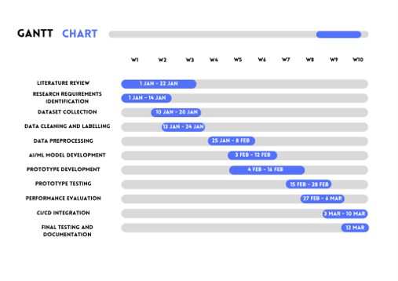

# ai-devsecops-pipeline
AI AUTOMATED WEB VULNERABILITY DETECTION INTEGRATED WITH DEVSECOPS
# CHAPTER 1: INTRODUCTION

## 1.1 Introduction

In the evolving landscape of modern software engineering, web applications have become an essential platform for business operations, handling critical transactions and storing sensitive user information. However, their widespread accessibility also makes them attractive targets for cyberattackers. Among the common threats are injection flaws and client-side scripting attacks, which are highlighted in the Open Web Application Security Project (OWASP) Top 10.

This chapter introduces the main issues addressed in this research and provides the background needed to understand the study. It discusses the problem statement, research aims and objectives, as well as the rationale and significance of the research. By establishing the context of the study, this chapter explains why the issue is important and worth investigating. It also outlines the direction of the research and the objectives that the study aims to achieve.

---

## 1.2 Background of the Study

To support faster software release cycles, many software engineering teams have adopted DevSecOps practices that integrate security controls directly into Continuous Integration and Continuous Deployment (CI/CD) pipelines. Traditional security testing methods, particularly Static Application Security Testing (SAST) and Dynamic Application Security Testing (DAST), are often incorporated into these pipelines. However, these tools can generate a high number of false positives and may require considerable execution time, which can slow down build and deployment processes.

Artificial Intelligence (AI) and Machine Learning (ML) provide a potential way to address these limitations by going beyond conventional rule-based scanning. Instead of relying solely on predefined security rules, AI-driven techniques can learn from code structures and web traffic patterns to identify and classify vulnerabilities based on their context. When lightweight AI inference models are integrated into DevSecOps pipelines, security checks can be performed more efficiently while reducing unnecessary alerts. This can help development teams maintain continuous security enforcement without significantly affecting the speed of software delivery.

### System Conceptual Architecture

*Figure 1.1: Conceptual Architecture of Proposed AI-Assisted DevSecOps Framework*

---

## 1.3 Problem Statement

Despite the growing use of automated security tools in DevSecOps pipelines, software development teams still face several challenges when trying to maintain effective and efficient security testing:

* **a. High False-Positive Rates:** Existing SAST and DAST tools can generate a large number of false-positive results. As a result, developers and security engineers often need to manually review and validate flagged issues, which takes additional time and effort that could otherwise be spent on development activities.
* **b. Deployment Bottlenecks:** Another challenge is the time and computational resources required for comprehensive dynamic security testing. When these scans take too long to complete, they can slow down pipeline execution and make it more difficult for development teams to maintain rapid release cycles.
* **c. Limited Context-Aware Detection:** Traditional rule-based detection methods also have limitations when dealing with the complexity of modern web applications. Since they mainly rely on predefined patterns and rules, they may not fully understand the context of the code being analyzed. This can result in vulnerabilities being overlooked, including previously unknown or zero-day vulnerabilities, while legitimate code may sometimes be incorrectly classified as a security threat.

---

## 1.4 Research Questions

1. **RQ1:** What are the current limitations and capabilities of existing software security testing tools and AI-based vulnerability detection techniques for web applications?
2. **RQ2:** How can an AI-assisted web vulnerability detection prototype be designed and seamlessly integrated into an automated DevSecOps pipeline?
3. **RQ3:** How effective is the proposed AI-assisted approach in terms of detection accuracy, false-positive rate reduction, and overall execution speed?

---

## 1.5 Research Objectives

1. **RO1:** To analyze existing software security testing and AI-based vulnerability detection techniques for web applications.
2. **RO2:** To design and develop a prototype for automated detection of selected web application vulnerabilities using an AI-assisted approach.
3. **RO3:** To evaluate the proposed approach based on detection performance, false-positive rate, and detection time.

---

## 1.6 Scope of Study

This research focuses on the automated detection of key web application vulnerabilities (specifically SQL Injection and Cross-Site Scripting) within source code and HTTP request parameters. The AI detection model will utilize supervised machine learning techniques trained on standard benchmark vulnerability datasets. The prototype will be integrated into a containerized CI/CD environment (such as GitHub Actions or GitLab CI) to simulate a real-world DevSecOps execution workflow.

---

## 1.7 Significance of Study

This study contributes to the field of software security and DevSecOps automation by demonstrating how machine learning algorithms can upgrade vulnerability detection without impeding deployment velocity. The outcome benefits software developers, DevSecOps engineers, and security analysts by providing an intelligent, context-aware scanning mechanism that minimizes manual triage effort and accelerates secure software delivery.

---

# CHAPTER 3: RESEARCH METHODOLOGY

## 3.1 Research Methodology

This research uses a data-driven methodology to guide the development and evaluation of the proposed AI-assisted web vulnerability detection prototype. The methodology focuses on preparing vulnerability data, developing the AI model, evaluating its performance, and integrating the prototype into a CI/CD environment.

The main stages of the proposed methodology are:

1. Problem Identification
2. Data Collection
3. Data Preparation
4. AI Model Development
5. Model Evaluation
6. CI/CD Integration and Testing

---

## 3.2 Development Model

The Prototyping Model is used to develop the proposed AI-assisted web vulnerability detection prototype. The prototype will be developed, tested, and improved in stages before being integrated into the CI/CD environment.

The main stages include Requirement Identification, Prototype Development, Testing and Evaluation, and Prototype Integration.

---

## 3.3 Justification

The data-driven methodology is suitable because the proposed system uses vulnerability data to train and test the AI model for detecting SQL Injection (SQLi) and Cross-Site Scripting (XSS).

The Prototyping Model is suitable because the proposed system is developed as a prototype. It allows the system to be tested and improved before the final integration into the CI/CD environment.

---

## 3.4 Proposed System Architecture

The proposed system architecture consists of two main parts: Model Preparation and Vulnerability Detection.

The Model Preparation process involves collecting and preparing the SQL Injection (SQLi) and Cross-Site Scripting (XSS) vulnerability dataset through cleaning, labelling, preprocessing, and feature extraction. The prepared data is then used to train the supervised AI/ML model.

During Vulnerability Detection, source code and HTTP request parameters are provided as inputs. The input is processed and converted into features before being passed to the trained AI/ML model. The model classifies the input as SQL Injection, Cross-Site Scripting, or Safe. The result is then passed to the CI/CD pipeline to generate a security report or alert.

*Figure 3.1: Proposed System Architecture*

---

## 3.5 System Flowchart

The proposed system flowchart shows the sequence of the vulnerability detection process. The process starts with source code or HTTP request parameters as input.

The input goes through data preprocessing and feature extraction before being processed by the trained AI/ML model. The system then determines whether a vulnerability is detected. If a vulnerability is detected, it is classified as SQL Injection or Cross-Site Scripting. Otherwise, the input is classified as Safe.

The result is then passed to the containerized CI/CD pipeline to generate a security report or alert.

*Figure 3.2: Proposed System Flowchart*

---

## 3.6 Preliminary Technical Components

Preliminary source code components were developed to demonstrate the feasibility and technical direction of the proposed system.

- `preprocessing.py` – performs basic cleaning and normalization of source code or HTTP request input.
- `feature_extraction.py` – extracts features from the processed input for vulnerability detection.
- `vulnerability_detection.py` – demonstrates a preliminary supervised machine learning approach to classify inputs as SQL Injection (SQLi), Cross-Site Scripting (XSS), or Safe.

The current implementation is a preliminary proof-of-concept and will be further developed using the selected vulnerability dataset during the implementation stage.

The source code is available in the `04_Source_Code/` directory.

---
## 3.7 Ethical and Legal Considerations

Ethical and legal considerations are important in this research because the study involves cybersecurity vulnerability data and the testing of web application security. The research will therefore be conducted using authorised, publicly available, or benchmark datasets and controlled testing environments.

First, only datasets that are legally accessible and appropriate for academic research will be used. The research will not collect or use confidential personal information, private user data, authentication credentials, or proprietary source code without proper permission. Any dataset obtained from external sources will be appropriately acknowledged and referenced in accordance with academic requirements.

Second, all vulnerability testing will be performed in a controlled environment. The proposed prototype will be tested using prepared vulnerability samples and authorised test applications rather than real-world systems belonging to individuals or organisations. This approach reduces the possibility of causing disruption, unauthorised access, data loss, or other security incidents.

Third, the researchers will not perform unauthorised penetration testing or vulnerability scanning against external websites, servers, or networks. SQL Injection and Cross-Site Scripting payloads will only be used against systems and datasets that are specifically created, provided, or authorised for testing purposes. Any security findings generated during the research will be handled responsibly and will not be used to exploit real systems.

Data confidentiality and integrity will also be maintained throughout the research process. Research data, model outputs, and testing results will be stored securely and will only be accessed by authorised members of the research team. Where applicable, identifying information will be excluded from datasets and research results.

Finally, academic integrity will be maintained throughout the study. All datasets, research papers, software tools, algorithms, and other external resources used in the research will be properly acknowledged and referenced. The research will also comply with the academic integrity and plagiarism requirements of Universiti Kuala Lumpur. The purpose of the prototype is strictly academic and research-oriented, with the objective of improving automated vulnerability detection and supporting secure software development.

---

## 3.8 Proposed Evaluation Plan

The proposed evaluation plan will be used to determine the effectiveness and performance of the AI-assisted web vulnerability detection prototype. The evaluation is directly aligned with the third research objective, which is to evaluate the proposed approach based on detection performance, false-positive rate, and detection time.

The prototype will be evaluated using test samples containing both vulnerable and non-vulnerable inputs. The test data will include SQL Injection and Cross-Site Scripting cases representing the two vulnerability types selected within the scope of this research. The model's predictions will then be compared with the actual labels of the test samples.

Three main evaluation metrics will be used:

### 1. Detection Accuracy

Detection accuracy will measure the percentage of test cases that are correctly classified by the proposed AI model. This metric will determine how effectively the prototype can distinguish between safe inputs, SQL Injection, and Cross-Site Scripting.

The accuracy can be calculated using the following formula:

**Accuracy = (Number of Correct Predictions / Total Number of Predictions) × 100%**

A higher accuracy percentage will indicate that the model is more effective at correctly identifying the tested vulnerability classes.

### 2. False-Positive Rate

The false-positive rate will measure the proportion of legitimate or safe inputs that are incorrectly classified as vulnerable. This metric is important because excessive false-positive results may increase the manual workload of developers and security analysts.

The false-positive rate can be calculated as:

**False-Positive Rate = FP / (FP + TN) × 100%**

where FP represents false positives and TN represents true negatives.

A lower false-positive rate will indicate that the proposed system can reduce unnecessary security alerts and improve the efficiency of automated security testing.

### 3. Detection Time

Detection time will measure the time required by the prototype to analyse an input and produce a vulnerability classification. The detection time will be recorded during testing and compared across different test cases.

This metric is particularly important because the proposed prototype is intended to operate within a CI/CD environment. A shorter detection time would allow security testing to be performed without significantly delaying the software development and deployment process.

The evaluation results will be presented using tables and appropriate graphical representations. The results will then be analysed to determine whether the proposed prototype achieves its intended objectives. The final evaluation will also consider the prototype's suitability for integration into a containerised CI/CD environment.

### Proposed Evaluation Metrics

| Evaluation Metric | Measurement | Expected Interpretation |
|---|---|---|
| Detection Accuracy | Percentage of correctly classified samples | Higher accuracy indicates better vulnerability detection performance |
| False-Positive Rate | Percentage of safe inputs incorrectly classified as vulnerable | Lower rate indicates fewer unnecessary security alerts |
| Detection Time | Time required to analyse and classify an input | Lower detection time indicates better suitability for CI/CD |
| CI/CD Integration | Successful execution within the containerised pipeline | Successful integration demonstrates practical DevSecOps applicability |

---

## 3.9 Proposed Timeline / Gantt Chart

The proposed timeline follows the activities required to complete the research, develop the AI-assisted vulnerability detection prototype, evaluate its performance, and integrate it into a containerised CI/CD environment.

The timeline is based on the research methodology and Prototyping Model described in this study, which consists of requirements identification, prototype development, testing and evaluation, improvement, and prototype integration.

The timeline may be adjusted according to the actual project schedule and progress. The activities are arranged sequentially where necessary, while some activities may be performed concurrently to improve project efficiency.

*Figure 3.5: Proposed Timeline / Gantt Chart*

---

## 3.10 Expected Outcomes

The proposed research is expected to produce an AI-assisted web vulnerability detection prototype capable of identifying selected web application vulnerabilities, specifically SQL Injection and Cross-Site Scripting.

The prototype will accept source code and HTTP request parameters as inputs and classify the inputs according to their security status. The proposed architecture is designed to classify inputs as Safe, SQL Injection, or Cross-Site Scripting and generate a security report or alert when a vulnerability is detected.

The first expected outcome is an effective machine learning model that can detect the selected vulnerability types with an acceptable level of detection accuracy. The model will be trained using prepared vulnerability data and evaluated using unseen test samples.

The second expected outcome is a reduction in false-positive results. By using an AI-assisted approach, the prototype is expected to provide more context-aware vulnerability classification and reduce unnecessary security alerts.

The third expected outcome is an efficient detection process with a reasonable detection time. Since the proposed solution is intended for integration into a CI/CD pipeline, the prototype is expected to perform security analysis without creating significant delays in the software development and deployment process.

The fourth expected outcome is successful integration of the vulnerability detection prototype into a containerised CI/CD environment. This integration is expected to demonstrate how AI-assisted security testing can be incorporated into a DevSecOps workflow and automatically generate security findings or alerts during the development process.

Overall, the research is expected to demonstrate the feasibility of combining artificial intelligence, automated vulnerability detection, and DevSecOps practices into a single prototype. The findings may contribute to the development of more efficient and automated approaches to web application security testing while supporting the research gap identified in the literature review.

---

## References

The research papers and other sources used in this project are maintained in the `07_References/` directory.

[View References](07_References/references.md)
